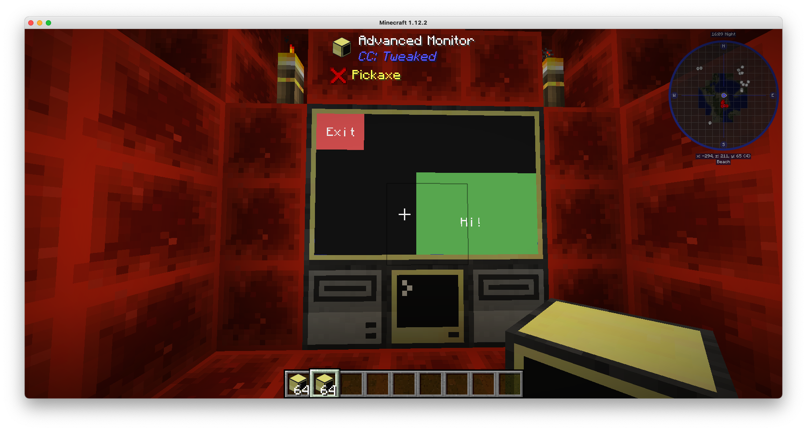

# Computer Craft Programs

Having fun with ComputerCraft (a MineCraft mod).

A collection of programs for use in the MineCraft ComputerCraft mod.



### Getting Started

```shell
npm install
npm start
```

### Installing Programs

Inside a computer or turtle, run:

```shell
wget http://enijar.eu.ngrok.io/run.lua
```

To save having to run `wget` (e.g. if you broke the computer), copy it to a disk by attaching a disk drive to the
computer and running:

```shell
cp run.lua disk/run.lua
```

When you make changes to a program, just run this to load and run the new program:

```shell
run
```

Or if you've loaded it onto a disk, run:

```shell
disk/run
```
